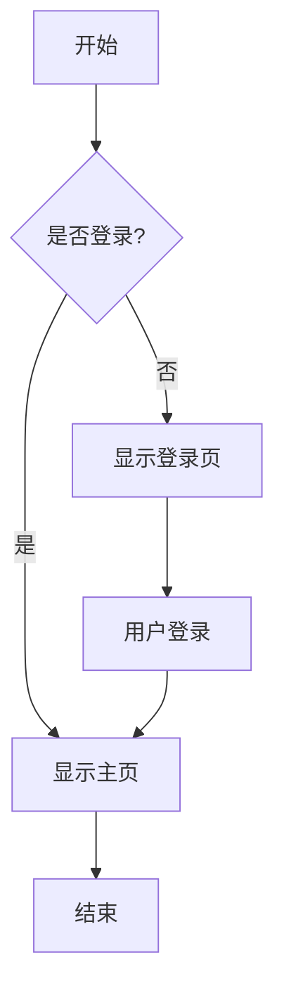
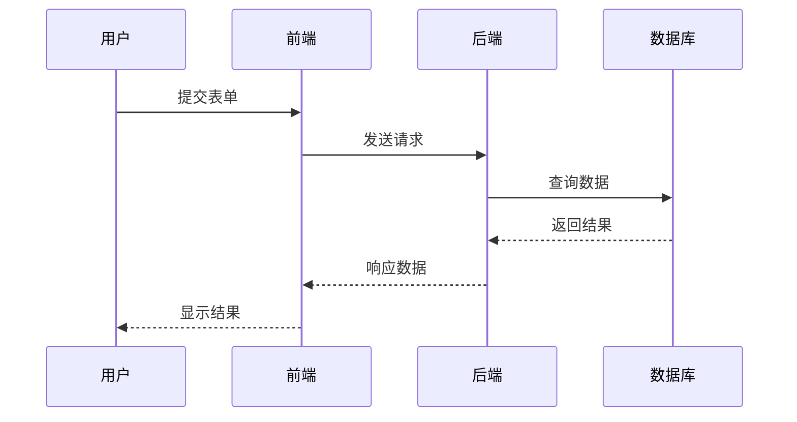
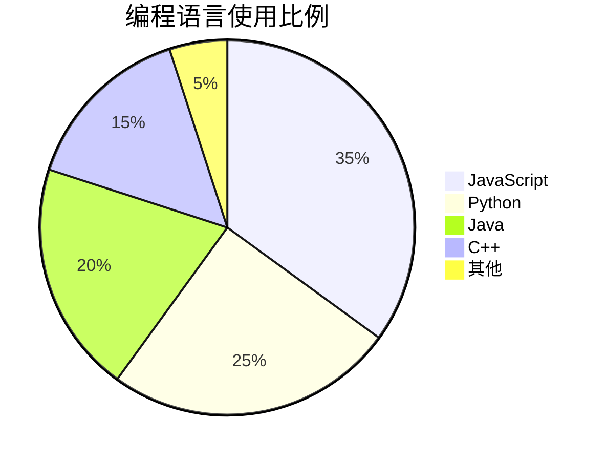

# Mermaid 图表测试

这是一个测试mermaid渲染功能的文档。

## 流程图示例

```mermaid
graph TD
    A[开始] --> B{是否登录?}
    B -->|是| C[显示主页]
    B -->|否| D[显示登录页]
    C --> E[结束]
    D --> F[用户登录]
    F --> C
```

## 序列图示例

```mermaid
sequenceDiagram
    participant 用户
    participant 前端
    participant 后端
    participant 数据库
    
    用户->>前端: 提交表单
    前端->>后端: 发送请求
    后端->>数据库: 查询数据
    数据库-->>后端: 返回结果
    后端-->>前端: 响应数据
    前端-->>用户: 显示结果
```

## 饼图示例

```mermaid
pie title 编程语言使用比例
    "JavaScript" : 35
    "Python" : 25
    "Java" : 20
    "C++" : 15
    "其他" : 5
```

这些图表应该能够正确渲染。