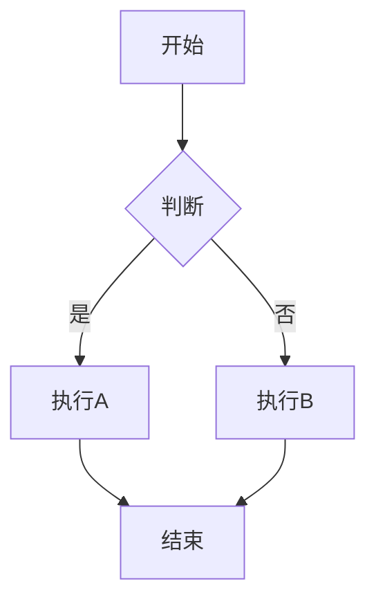

# Mermaid 测试

这是一个简单的Mermaid图表测试：

```mermaid
flowchart TD
    A[开始] --> B{判断}
    B -->|是| C[执行A]
    B -->|否| D[执行B]
    C --> E[结束]
    D --> E
```

另一个测试：

```mermaid
graph LR
    A[方块A] --> B[方块B]
    B --> C[方块C]
    C --> D[方块D]
```